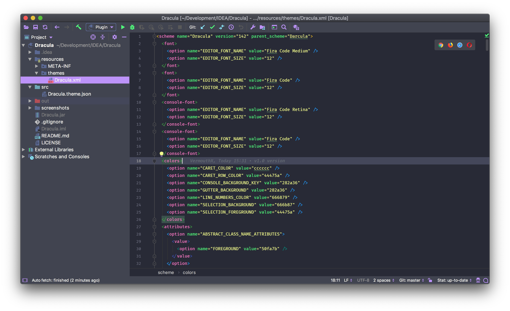

# Dracula for [IntelliJ IDEA](https://www.jetbrains.com/idea/)

> A dark theme for [IntelliJ IDEA](https://www.jetbrains.com/idea/)

## Install

1. Open the **Plugins** dialog
2. Search fot `Dracula` under the UI category
3. Click `Install` then `Restart`
4. Choose `Dracula` in **Appearance & Behaviour -> Appearance**

## License

[MIT License](./LICENSE)