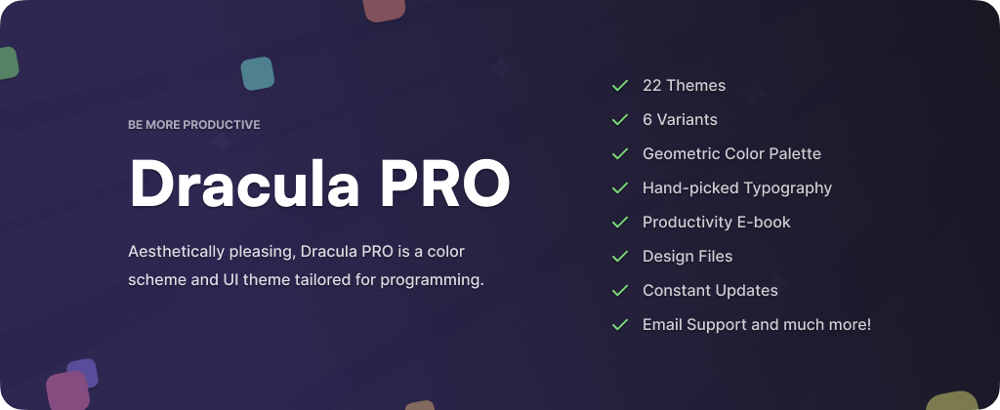

# Dracula for [JetBrains IDE](https://www.jetbrains.com/)

> A dark theme for [JetBrains IDE](https://www.jetbrains.com/)

## Install

All instructions can be found at [draculatheme.com/jetbrains](https://draculatheme.com/jetbrains).

## Dracula PRO

Dracula PRO is a color scheme and UI theme tailored for programming. Made for terminal emulators, code editors, and
syntax highlighters. Designed to be aesthetically pleasing while keeping you focused.

[Get It Now](https://gumroad.com/a/477820019)

## Contribution

If you'd like to contribute to this theme, please read the [Contributing Guide](./CONTRIBUTING.md).

## Team

This theme is maintained by the following person(s) and a bunch
of [awesome contributors](https://github.com/dracula/jetbrains/graphs/contributors).

|  |
|------------------------------------------------------------------------------------------------------------|
| [Zihan Ma](https://github.com/WhiteVermouth)                                                               |

## Community

- [Twitter](https://twitter.com/draculatheme) - Best for getting updates about themes and new stuff.
- [GitHub](https://github.com/dracula/dracula-theme/discussions) - Best for asking questions and discussing issues.
- [Discord](https://draculatheme.com/discord-invite) - Best for hanging out with the community.

## License

[MIT License](./LICENSE)
